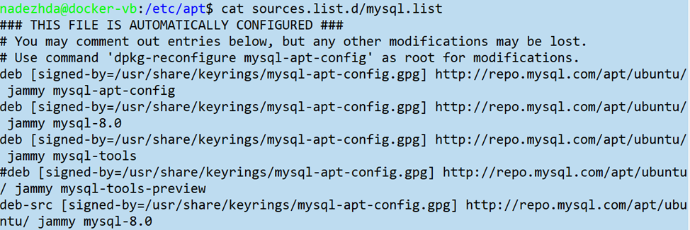

## Задания 1 - 5 по linux

1. Используя команду cat в терминале операционной системы Linux, создать
   два файла Домашние животные (заполнив файл собаками, кошками,
   хомяками) и Вьючные животными заполнив файл Лошадьми, верблюдами и
   ослы), а затем объединить их. Просмотреть содержимое созданного файла.
   Переименовать файл, дав ему новое имя (Друзья человека).

         $ cat > 'Домашние животные'
         собаки
         кошки
         хомяки
         $ cat > 'Вьючные животные'
         лошади
         верблюды
         ослы
         $ cat Домашние\ животные Вьючные\ животные > 'Общий список'
         $ cat Общий\ список
         собаки
         кошки
         хомяки
         лошади
         верблюды
         ослы
         $ mv Общий\ список 'Друзья человека'
         $ rm Домашние\ животные Вьючные\ животные
         $ ls
         'Друзья человека'
2. Создать директорию, переместить файл туда.

         $ mkdir животные
         $ mv Друзья\ человека животные/
3. Подключить дополнительный репозиторий MySQL. Установить любой пакет
   из этого репозитория.
4. Установить и удалить deb-пакет с помощью dpkg.
5. Выложить историю команд в терминале ubuntu

         $ wget https://dev.mysql.com/get/mysql-apt-config_0.8.25-1_all.deb
         Сохранение в: ‘mysql-apt-config_0.8.25-1_all.deb’
         $ sudo dpkg -i mysql-apt-config_0.8.25-1_all.deb
         $ sudo dpkg -l | grep mysql
         ii  mysql-apt-config   0.8.25-1    all    Auto configuration for MySQL APT Repo.

         $ sudo apt update (без ошибок)
         $ sudo dpkg -r mysql-apt-config
         Удаляется mysql-apt-config (0.8.25-1) …
         $ sudo dpkg -l | grep mysql
         $ rc  mysql-apt-config  …
